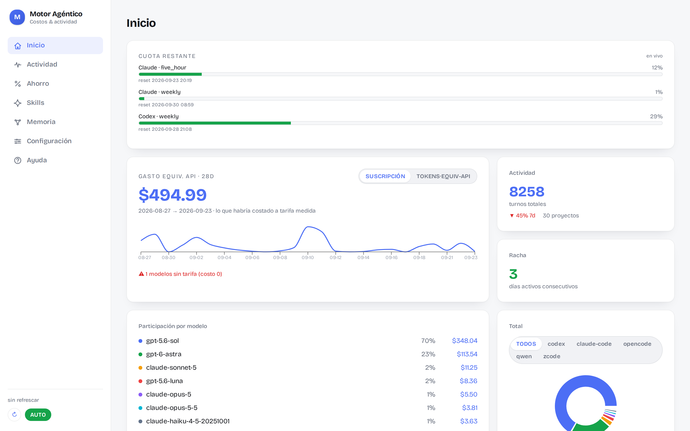
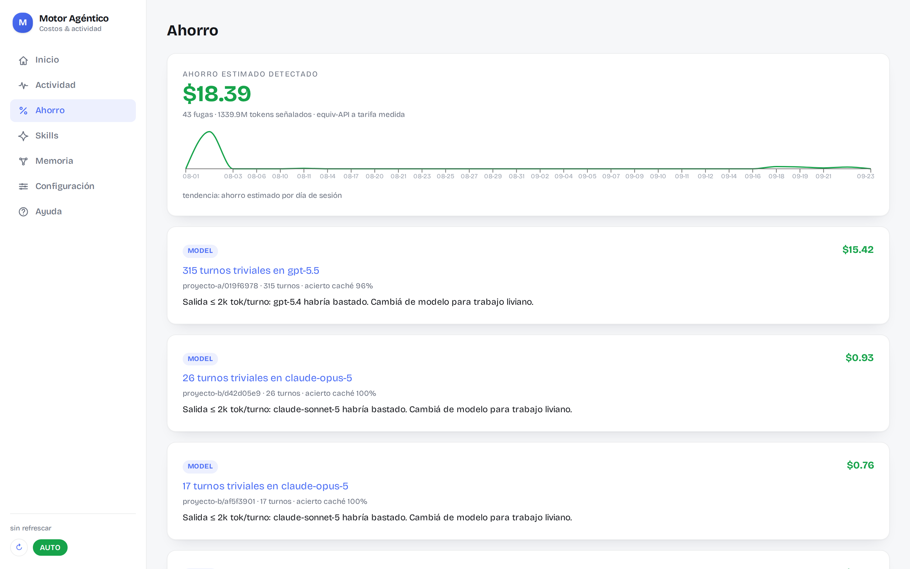
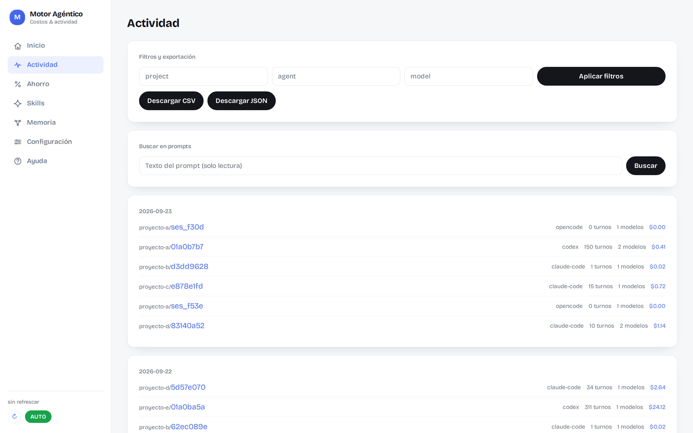
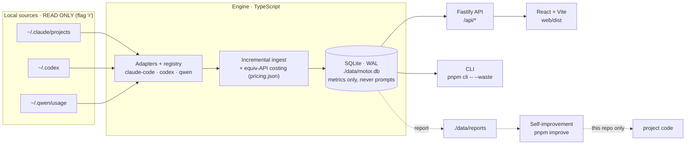

# How much did u waste? · v0.0.2-beta

[](https://github.com/Adudu02/How-much-did-U-waste/actions/workflows/ci.yml)

A local-first cost & activity dashboard for coding agents. It reads Claude Code
(`~/.claude/projects`), Codex (`~/.codex`) and Qwen (`~/.qwen/usage`) transcripts
in **read-only** mode, computes the "API-equivalent" spend, and points at where
tokens are leaking and how to cut it.







> **Real example** (`pnpm cli -- --waste` over the author's own transcripts):
> **98 leaks found, ~$310 estimated savings**. The biggest: a single session with
> 258 trivial turns running on `claude-opus-4-8` when `claude-sonnet-5` was
> enough — **~$28 of overspend in that one session**. The engine doesn't just
> measure spend; it says where to cut it, with the number.

## Principle

`~/.claude`, `~/.codex`, `~/.qwen` and every other source = **READ ONLY** (opened
with the `'r'` flag, see `packages/core/src/lib/fs-readonly.ts`). All own state
(DB, reports) lives in `./data/`.

## Architecture



The registry decouples sources: adding a fourth agent = one new adapter
(`discover` / `deriveIds` / `parseLines`), without touching ingest or the API.
Self-improvement reads reports and proposes changes **to this repo only** — it
never rewrites the source transcripts.

## Try it (no clone needed)

```bash
npx how-much-did-u-waste
```

Serves the dashboard at `http://127.0.0.1:8081`. It detects your transcripts
(Claude Code, Codex, Qwen) read-only and writes its state to `./data` in the
directory where you run it. Terminal waste report: `npx how-much-did-u-waste --waste`.

## Quick start (from the repo)

Requires **Node.js 22+** and **pnpm** (`corepack enable pnpm`). SQLite uses
`better-sqlite3`, with WAL and drop-in compatibility with an existing cache.

```bash
pnpm install
pnpm start         # builds the UI if missing and serves http://127.0.0.1:8081
```

`pnpm start` is self-repairing: if dependencies or the built UI are missing it
generates them before starting (so it works the same on a fresh clone). On
Linux/macOS, `./start.sh` does the same and also opens the browser. If a
dashboard is already running, it just opens the browser instead of starting a
second server.

After pulling new code, run `./start.sh --update` (or `pnpm run update`) to
reinstall dependencies, rebuild the dashboard and restart the server.

## Connect agents (local)

Read-only, no logins, no keys. On startup it auto-detects Claude Code
(`~/.claude/projects`), Codex (`~/.codex/sessions` + `archived_sessions`) and
Qwen (`~/.qwen/usage`). For different paths: **Settings → Agent paths** (accepts
`~/`; keys `claude-code` / `codex` / `qwen` in `data/config.json → agentPaths`),
then **Rebuild**. See the **Help** page in the UI.

## Security

- **No API keys.** It computes *API-equivalent* cost from local token counts; it
  never asks for, receives or stores credentials.
- **Sources untouched.** Everything with the `'r'` flag;
  [`packages/core/test/integrity.test.ts`](packages/core/test/integrity.test.ts)
  hashes the source tree before/after ingesting and demands an identical hash —
  see the test that guarantees it, not just this claim.
- **Read whitelist.** Only `rollout-*.jsonl`, `*.jsonl` and memory `*.md`. It
  never opens `~/.codex/auth.json`, `.env` or credential files.
- **Metrics only in the DB.** `./data/motor.db` stores token counts, model and
  skill names — **never** your prompt text. The Activity drill-down does show
  your prompts: it reads them from the original transcript (read-only) at query
  time and persists them nowhere.
- **No network.** The server binds to `127.0.0.1:8081` only, no auth. Don't
  expose it to the LAN or behind a public proxy.
- **Minimal dependency tree:** the app uses `fastify` + `@fastify/static` +
  `how-much-did-u-waste-core`; the engine only `better-sqlite3`. `pnpm audit` is clean
  at runtime and dev. Threat model, dependency posture and disclosure in
  [`SECURITY.md`](SECURITY.md).

## Commands

```bash
pnpm start          # one-command start: installs/builds if missing, then serves
pnpm cli            # prints spend/model/day table (Claude Code + Codex + Qwen)
pnpm rebuild        # deletes ./data/motor.db and re-ingests everything (rebuildable cache)
pnpm improve        # reads the latest ./data/reports and launches Claude Code to fix (--dry: print only)
pnpm serve          # API + UI at http://127.0.0.1:8081 (incremental ingest on boot)
pnpm dev            # serve + Vite dev (HMR frontend on :5173, /api proxied to :8081)
pnpm build:web      # production build of the frontend to web/dist (served by `serve`)
pnpm test           # vitest (128 tests)
pnpm test:coverage  # vitest with v8 coverage report (text + html)
pnpm lint           # Biome (recommended rules), check-only
pnpm typecheck      # tsc --noEmit
```

## Highlights (current state)

- **Multi-agent ingest** via the adapter registry — Claude Code, Codex and Qwen
  (including Qwen skill usage detection), with incremental offsets per file.
- **Stable URLs & per-page code splitting** — React Router with deep links and
  browser back/forward; the server serves the SPA for non-API routes. The
  initial bundle dropped from a single 569 KB chunk (over Vite's warning
  threshold) to ~235 KB, with Recharts loading only on chart pages.
- **Accessibility foundations** — semantic heading hierarchy, accessible names
  on icon-only controls, `aria-pressed` toggles, visible `:focus-visible` rings,
  labeled SVG graph.
- **Resilient UI** — per-page error boundary with retry (no more blank screen on
  render crashes) and live JSON validation in Settings (free editing, immediate
  feedback, save blocked while invalid).
- **Quality gates** — 128 tests (core + reporter + server), v8 coverage tooling,
  Biome `recommended` with zero errors, CI matrix on Node 22 & 24 with
  `pnpm audit --audit-level=moderate`.
- **Storage with versioning** — `SCHEMA_VERSION` + `schema_info` table, ordered
  migrations, and an actionable error when opening a DB written by a newer
  version. `searchPrompts` streams transcripts line-by-line (no full-file loads).
- **Specs live in the repo** — the product requirements live in
  [`openspec/specs/`](openspec/specs/) (5 capabilities), maintained through the
  OpenSpec workflow; every change lands with its proposal, spec delta, design
  and task list archived under `openspec/changes/archive/`.

### Milestones

- **F1** — Claude Code adapter + cost engine + CLI. Dedup by `message.id:requestId`,
  skips `<synthetic>`, unknown model = cost 0 + badge.
- **F2** — SQLite (`better-sqlite3`, WAL) + incremental ingest (per-file offsets)
  + Fastify server (binds `127.0.0.1` only) + Home page (Vite/React/Tailwind/
  Recharts): 28d spend + sparkline, activity, streak, share by model (donut),
  Subscription↔Tokens toggle.
- **F3** — Skills + Settings. Usage detection (`<command-name>/x</command-name>`
  in user events + `Skill` tool_use), `~/.claude/skills`/`commands` catalog
  (frontmatter), `./data/config.json` (hourly rate, min/use, staleness threshold).
  Skills page (grid, category filter, $ saved) and Settings (parameters +
  `pricing.json` editor). `$ saved = uses·min·rate/60`, recalculated live.
- **F4** — Memory + Activity. `scanMemory` reads `~/.claude/projects/*/memory/*.md`
  (RO): memory/index/session/project nodes, edges by `[[wikilink]]`/md link,
  `originSessionId`, index (contains). Memory page = force-directed SVG graph;
  Activity page = paginated filterable timeline with per-session drill-down,
  on-demand prompt search and metric export.
- **F6** — self-improvement + integrity. The integrity test hashes the source
  tree (path·size·mtime) around an ingest cycle and demands an identical hash.
  Every real ingest writes `./data/reports/run-<ts>.json`; `pnpm improve` reads
  the latest report and launches Claude Code **on this repo** (never on the
  sources) to fix parsers/heuristics and add tests; `--dry` prints the prompt.
- **F-waste** — the waste analysis (now the Ahorro page). Unlike the rest of the dashboard (which MEASURES
  spend), it flags WHERE tokens leak and what to do: *cache-miss* (low cache hit
  rate; context re-sent as 1× input instead of 0.10× reads), *session-bloat*
  (huge sessions; informational, suggests splitting) and *model-mismatch*
  (expensive model on trivial turns; savings = actual − cost at the target
  model's rate). Thresholds in `data/config.json → waste`. CLI: `pnpm cli -- --waste`.
  *Trend*: `trend` in `/api/waste` attributes estimated savings per session day —
  derived from current state, NO snapshots.
- **F5** — Codex adapter + adapter registry. Reads JSONL rollouts from
  `~/.codex/sessions/**` and `~/.codex/archived_sessions/` (READ ONLY); one
  `UsageEvent` per `token_count` event. OpenAI rates in `pricing.json`. A new
  model without a rate still shows cost 0 + badge — never silently estimated.

## Embedding the engine

The engine ships as two workspace packages with a one-way dependency
(`insights → core`), so you can reuse token measurement without inheriting this
dashboard's opinions:

- **`how-much-did-u-waste-core` — Tier 1: generic measurement.** Adapters (Claude
  Code, Codex, Qwen), incremental ingest, metrics-only SQLite, API-equivalent
  costing and aggregate views. If you want to measure token usage from any
  dashboard, harness or backend, this is all you need:

  ```ts
  import { setDataDir, rebuild, openDb, defaultDbPath, getSummary } from "how-much-did-u-waste-core";

  setDataDir("/path/for/state"); // DB + reports live here (default: <cwd>/data)
  await rebuild();
  const summary = getSummary(openDb(defaultDbPath()));
  ```

- **`how-much-did-u-waste-insights` — Tier 2: this dashboard's domain.** Waste
  findings (leak detection with configurable thresholds), the skills catalog,
  the Claude Code memory graph, the user `config.json`, and the `rebuild`
  orchestrator that combines ingest + memory sync. Add it only if you want
  those opinions too.

Both import everything from their package barrel — never from internal routes.

## API

`GET /api/summary` · `GET /api/skills` · `GET /api/memory` · `GET /api/activity` ·
`GET /api/activity/search` · `GET /api/export?format=csv|json` · `GET /api/waste` ·
`GET /api/session/:id` · `GET /api/session/:id/turns` · `GET|PUT /api/config` ·
`GET|PUT /api/pricing` · `GET /api/quota` · `POST /api/quota/refresh` ·
`POST /api/rebuild` · `POST /api/refresh` · `GET /api/health`.

`/api/activity` accepts `limit` (max 100), `cursor`, `project`, `agent` and
`model`, and responds `{ days, nextCursor }`; use `nextCursor` for the next page.
`/api/activity/search?q=text` searches read-only transcripts on demand and
returns limited matches without writing prompts to SQLite. `/api/export`
includes only sessions and usage events; it never exports prompts. Editing
pricing → run `rebuild` to recompute already-materialized costs. Non-API routes
serve the SPA (deep links); unknown `/api/*` routes answer 404 JSON.

## Costs

`data/pricing.json` (editable). Per-event formula:

```
cost = in·rate_in + out·rate_out + cache_write·rate_in·1.25 + cache_read·rate_in·0.10
```

Labeled **API-equivalent**: what it would have cost at measured rates (the user
pays a subscription). Unknown model → cost 0 + warning, never silently estimated.

## Changelog

### 2026-09 — Quota panel, self-update & UI polish

- **Quota panel (offline-first).** New Home section + `pnpm quota` CLI showing
  your Claude plan limits (5-hour and weekly windows) from local state.
  `GET /api/quota` always answers from cache (never blocks on the network);
  when the cache is stale an auto-refresh runs in the background, and
  `POST /api/quota/refresh` forces it (30 s debounce).
- **`pnpm run update` / `./start.sh --update`.** One command to reinstall
  dependencies, rebuild the dashboard and restart the server after pulling.
- **SQLite via WASM.** `@sqlite.org/sqlite-wasm` replaces the native
  `better-sqlite3` binding — no compiler toolchain needed to install or
  publish, same WAL mode and on-disk format.
- **UI fixes.** Arcade redesign follow-ups: Settings and Help page tweaks,
  hooks and CSS corrections, `/api/health` now reports the server PID, and the
  stray `guia-qwen.html` was removed from the repo.
- **Fixture hygiene.** The "real transcript" test fixtures were scrubbed
  (embedded file contents and identifiers removed); they still exercise the
  same parser paths.

### 2026-09 — Arcade redesign

- Light theme by default, sidebar navigation, pill components, inline SVG
  favicon (no more `/favicon.ico` 404s), Ahorro pagination and pricing JSON
  feedback fixes, agent labels in Actividad.

### 2026-08 — Quality wave

- React Router with stable URLs and per-page code splitting (initial bundle
  569 KB → ~235 KB), accessibility foundations (focus rings, ARIA names,
  labeled SVG), per-page error boundary with retry, DB schema versioning with
  ordered migrations, streaming `searchPrompts`, CI matrix on Node 22/24 with
  `pnpm audit`. See `docs/MEJORAS.md` for the full 21-item traceability table.
