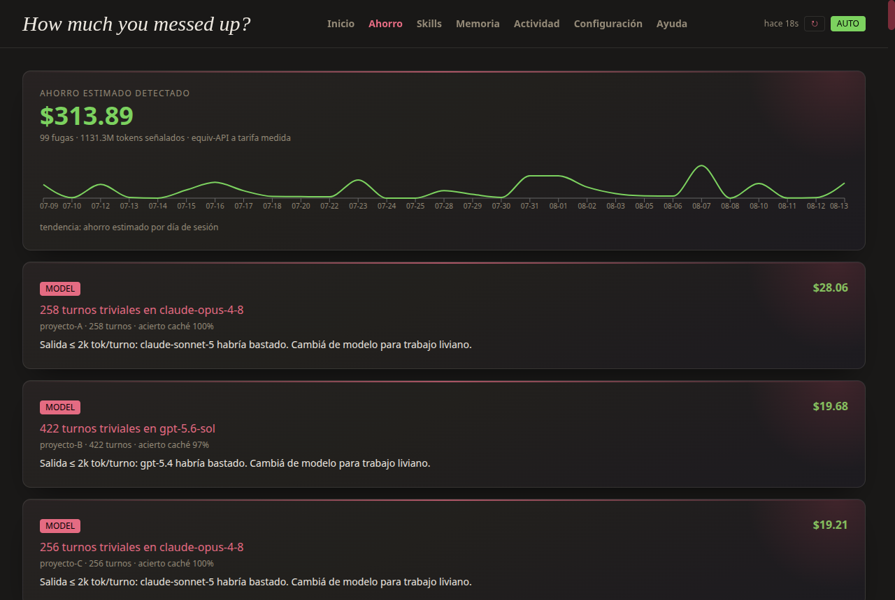
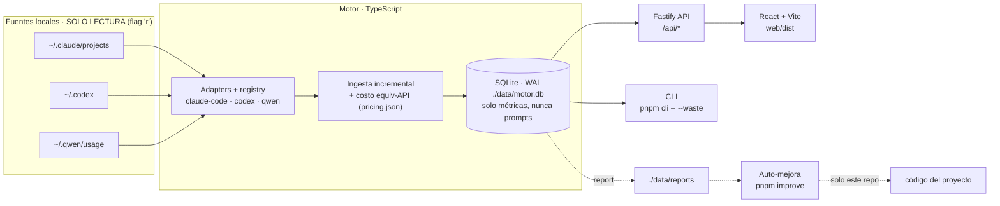

# Motor Agéntico · v1.0.0

[](https://github.com/Adudu02/DFT/actions/workflows/ci.yml)

Dashboard local de costos/actividad de agentes. Lee transcripts de Claude Code
(`~/.claude/projects`) y Codex (`~/.codex`) en **solo lectura** y calcula el gasto
"equivalente API", además de señalar fugas de tokens y cómo reducirlas.




> **Ejemplo real** (`pnpm cli -- --waste` sobre transcripts propios): **98 fugas
> detectadas, ~$310 de ahorro estimado**. La mayor: una sola sesión con 258 turnos
> triviales corriendo en `claude-opus-4-8` cuando `claude-sonnet-5` bastaba —
> **~$28 de sobrecosto en esa sesión**. El motor no solo mide el gasto: dice dónde
> recortarlo, con el número.

## Principio

`~/.claude`, `~/.codex` y otras fuentes = **SOLO LECTURA** (se abren con flag
`'r'`, ver `src/lib/fs-readonly.ts`). Todo estado propio (DB, reportes) vive en
`./data/`.

## Arquitectura



El registry desacopla las fuentes: añadir un cuarto agente = un adapter nuevo
(`discover` / `deriveIds` / `parseLines`), sin tocar la ingesta ni la API. La
auto-mejora lee reportes y propone cambios **solo sobre este repo** — nunca
reescribe los transcripts de origen.

## Pruébalo (sin clonar)

```bash
npx motor-agentico
```

Levanta el dashboard en `http://127.0.0.1:8081`. Detecta tus transcripts (Claude
Code, Codex, Qwen) en solo lectura y escribe su estado en `./data` del directorio
donde lo corras. Reporte de fugas por terminal: `npx motor-agentico --waste`.

## Inicio rápido (desde el repo)

Requiere **Node.js ≥ 20** y **pnpm** (`corepack enable pnpm`). SQLite usa
`better-sqlite3`, con WAL y compatibilidad directa con la caché existente.

```bash
pnpm install
pnpm start         # compila la UI si falta y sirve en http://127.0.0.1:8081
```

`pnpm start` se autorepara: si faltan dependencias o la UI compilada, las genera
antes de arrancar (así corre igual en un clon recién bajado). En Linux/macOS,
`./start.sh` hace lo mismo y además abre el navegador.

## Conectar agentes (local)

Solo lectura, sin login ni claves. Al arrancar detecta automáticamente Claude Code
(`~/.claude/projects`) y Codex (`~/.codex/sessions` + `archived_sessions`). Para
rutas distintas: **Configuración → Rutas de agentes** (acepta `~/`, claves
`claude-code` / `codex` en `data/config.json → agentPaths`) y luego **Rebuild**.
Ver la página **Ayuda** en la UI.

## Seguridad

- **No usa claves API.** Calcula costo *equivalente API* desde conteos de tokens
  locales; nunca pide, recibe ni almacena credenciales.
- **Fuentes intactas.** Todo con flag `'r'`; [`test/integrity.test.ts`](test/integrity.test.ts)
  hashea el árbol de fuentes antes/después de ingerir y exige que no cambie —
  ve el test que lo garantiza, no solo esta afirmación.
- **Lista blanca de lectura.** Solo `rollout-*.jsonl`, `*.jsonl` y memoria `*.md`.
  Nunca abre `~/.codex/auth.json`, `.env` ni archivos de credenciales.
- **Solo métricas en la DB.** `./data/motor.db` guarda conteos de tokens, modelo y
  nombres de skills — **nunca** el texto de tus prompts. El drill-down de Actividad
  sí muestra tus prompts: los lee del transcript original (solo lectura) en el
  momento de la consulta y no los persiste en ningún lado.
- **Sin red.** El servidor bindea solo a `127.0.0.1:8081`, sin auth. No exponerlo
  a la LAN ni detrás de un proxy público.
- **3 dependencias de producción** (`fastify`, `@fastify/static`, `better-sqlite3`)
  y runtime sin vulnerabilidades en `pnpm audit`. Modelo de amenazas, postura de
  dependencias y reporte de fallos en [`SECURITY.md`](SECURITY.md).

## Comandos

```bash
pnpm start          # inicio en un comando: instala/compila si falta y sirve
pnpm cli            # F1: imprime tabla gasto/modelo/día (Claude Code + Codex)
pnpm rebuild        # borra ./data/motor.db y reingesta todo (cache reconstruible)
pnpm improve        # lee el último ./data/reports y lanza Claude Code para corregir (--dry: solo imprime)
pnpm serve          # API + UI en http://127.0.0.1:8081 (ingesta incremental al arrancar)
pnpm dev            # serve + Vite dev (frontend con HMR en :5173, proxy /api → :8081)
pnpm build:web      # build de producción del frontend a web/dist (lo sirve `serve`)
pnpm test           # vitest
pnpm lint           # Biome, solo comprobación (no modifica archivos)
pnpm typecheck      # tsc --noEmit
```

## Estado

### Roadmap medio — completado (2026-08-05)

- SQLite usa `better-sqlite3` con WAL, índices de actividad y migración compatible
  con la caché previa; el servidor cierra una sola vez ante `SIGINT` o `SIGTERM`.
- `PUT /api/config` y `PUT /api/pricing` validan datos antes de persistirlos y
  responden `400` con un error claro. La UI muestra ese error.
- La sincronización de memorias hace upsert solo de los nodos cambiados y elimina
  exclusivamente los que desaparecieron de la fuente.
- Actividad admite cursor estable, límite máximo 100 y filtros `project`, `agent`
  y `model`; la UI permite cargar más, buscar prompts en vivo y exportar métricas.
- Las exportaciones CSV/JSON incluyen sesiones y eventos de uso, nunca prompts.
- Skills combina los catálogos de Claude Code y Codex; el escaneo Codex es recursivo
  bajo `~/.codex/skills`, excluye `vendor_imports` y muestra disponibilidad por agente.
- Biome ejecuta `pnpm lint` en modo comprobación y CI corre lint, typecheck, tests y
  build. La interfaz se verificó a 320 px, 375 px y escritorio.

`App.tsx` ya estaba dividido en shell, páginas, hooks y componentes, por lo que no
requirió una refactorización adicional. `data/config.json` incluye el bloque completo
`waste`, incluidos sus `downgradePaths`.

- **F1** — adapter Claude Code + motor de costos + CLI. Dedup por `message.id:requestId`,
  skip `<synthetic>`, modelo sin tarifa = costo 0 + badge.
- **F2** — SQLite (`better-sqlite3`, WAL) + ingesta incremental (offset por
  archivo) + servidor Fastify (bind solo `127.0.0.1`) + página Inicio (Vite/React/
  Tailwind/Recharts, tema terminal ámbar/negro): gasto 28d + sparkline, actividad,
  racha, participación por modelo (donut), toggle Suscripción↔Tokens.
- **F3** — Skills + Configuración. Detección de uso (`<command-name>/x</command-name>`
  en eventos user + `Skill` tool_use), catálogo `~/.claude/skills`/`commands` (frontmatter),
  `./data/config.json` (tarifa/hora, min/uso, umbral obsolescencia). Página Skills (grid,
  filtro por categoría, uso por categoría, $ ahorrado) y Configuración (parámetros +
  editor `pricing.json`). `$ ahorrado = usos·min·tarifa/60`, recalculado en vivo.
- **F4** — Memoria + Actividad. `scanMemory` lee `~/.claude/projects/*/memory/*.md` (RO):
  nodos memoria/índice/sesión/proyecto, aristas por `[[wikilink]]`/link md (referencia),
  `originSessionId` (origen) e índice (contiene). Página Memoria = grafo force-directed
  (SVG, simulación propia, brillo=recencia, amarillo=obsoleto, contador N·M). Página
  Actividad = timeline paginado y filtrable por sesión/día con drill-down (desglose
  por modelo), búsqueda puntual de prompts desde el transcript y exportación de métricas.

- **F6** — auto-mejora + integridad. Test de humo (`test/integrity.test.ts`):
  hashea el árbol de fuentes (path·size·mtime) antes/después de un ciclo de
  ingesta y exige hash idéntico (criterio §7: fuentes intactas). Cada ingesta
  real (rebuild/serve) escribe `./data/reports/run-<ts>.json` con líneas no
  parseables, modelos sin tarifa, adapters sin datos y tiempos. `pnpm improve`
  lee el último reporte y lanza Claude Code **sobre este repo** (nunca sobre las
  fuentes) para corregir parsers/heurísticas y añadir tests; `--dry` solo imprime
  el prompt.

- **F-waste** — página Ahorro. A diferencia del resto del dashboard (que MIDE el
  gasto), señala DÓNDE se fugan tokens y qué hacer (objetivo: gastar menos).
  `getWaste` (`src/lib/waste.ts`) lee la DB y produce hallazgos rankeados:
  *cache-miss* (UC1 — sesión con baja tasa de acierto de caché; el contexto se
  reenvía como `input` a 1× en vez de leerse a 0.10×; ahorro estimado = ese input
  a la diferencia de tarifa), *session-bloat* (UC3 — sesión enorme por turnos o
  tokens; informativo, recomienda partir) y *model-mismatch* (UC2 — modelo caro en
  turnos triviales; ahorro = costo real − costo a la tarifa del modelo destino).
  Umbrales en `data/config.json → waste`. CLI: `pnpm cli -- --waste`.
  *Tendencia (UC5)*: `trend` en `/api/waste` atribuye el ahorro estimado al día de
  cada sesión — derivado del estado actual, SIN snapshots (las sesiones viejas caen
  en su día, así se ve si el desperdicio baja con el tiempo). Gráfico en la página
  Ahorro.

- **F5** — adapter Codex + registro de adapters. `src/adapters/codex.ts` lee los
  rollouts JSONL de `~/.codex/sessions/**` y `~/.codex/archived_sessions/` (SOLO
  LECTURA): un `UsageEvent` por evento `token_count` (`last_token_usage`; input =
  `input_tokens − cached_input_tokens`, cacheRead = cached), modelo del
  `turn_context`, sesión/proyecto del `session_meta` (cwd). `src/adapters/registry.ts`
  itera todos los adapters en la ingesta; `sessions.agent` distingue el origen.
  Tarifas OpenAI (`gpt-5.5`, `gpt-5.6-sol/terra/luna`) ya en `pricing.json`
  (verificadas 2026-07); cached-input = 10% del input, que el motor ya modela.
  Un modelo nuevo sin tarifa sigue mostrando costo 0 + badge — nunca se estima
  en silencio.

Pendiente: F5 adapter para más agentes si aparecen fuentes con transcript propio.

## API

`GET /api/summary` · `GET /api/skills` · `GET /api/memory` · `GET /api/activity` ·
`GET /api/activity/search` · `GET /api/export?format=csv|json` · `GET /api/waste` ·
`GET /api/session/:id` · `GET|PUT /api/config` · `GET|PUT /api/pricing` ·
`POST /api/rebuild` · `GET /api/health`.

`/api/activity` acepta `limit` (máximo 100), `cursor`, `project`, `agent` y `model`,
y responde `{ days, nextCursor }`; usá `nextCursor` para la siguiente página.
`/api/activity/search?q=texto` busca bajo demanda en transcripts de solo lectura y
devuelve coincidencias limitadas sin escribir prompts en SQLite. `/api/export` incluye
solo sesiones y eventos de uso; no exporta prompts. Editar pricing → correr `rebuild`
para recalcular costos ya materializados.

## Costos

`data/pricing.json` (editable). Fórmula por evento:

```
cost = in·rate_in + out·rate_out + cache_write·rate_in·1.25 + cache_read·rate_in·0.10
```

Etiquetado como **equivalente API**: lo que habría costado a tarifa medida (el usuario
paga suscripción). Modelo desconocido → costo 0 + aviso, nunca se estima en silencio.
