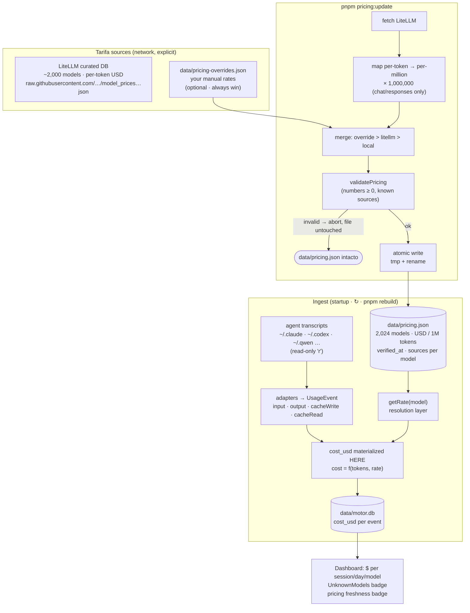
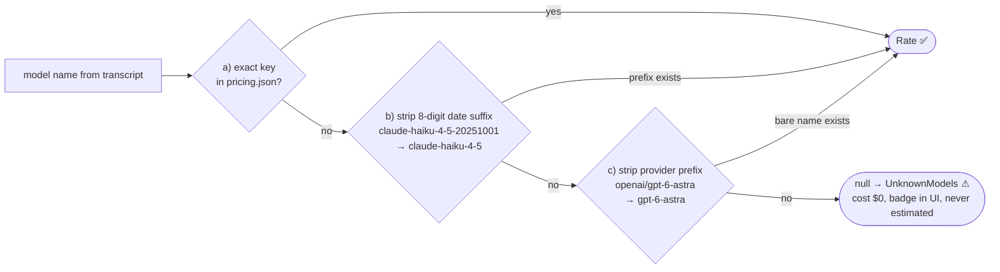
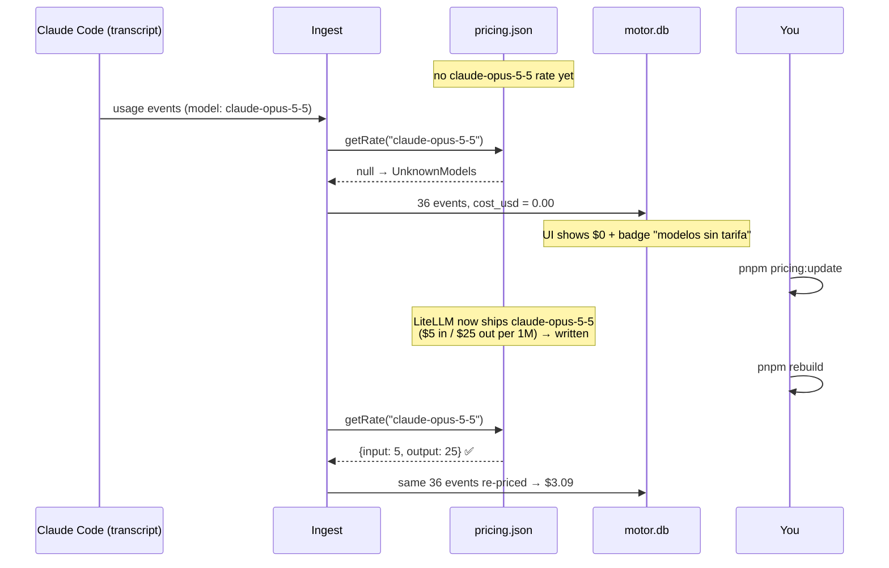
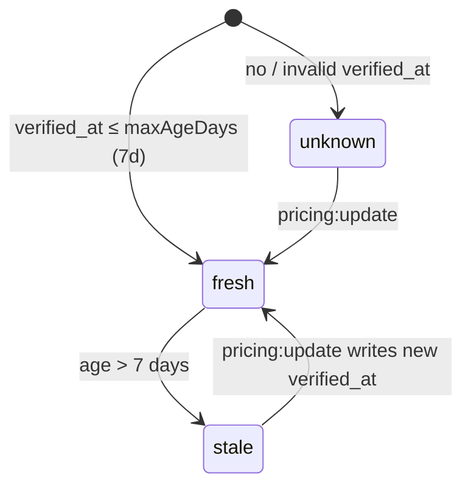

# How the Pricing System Works

> **Goal:** turn raw token counts from your agents' transcripts into **API-equivalent cost in USD** — never estimated silently, never losing a model to a missing rate.
>
> Real-world example used throughout: `claude-opus-5-5` was detected with **$0.00** because it was ingested before its rate existed — one `rebuild` later it showed **$3.09**. This doc explains why that happens and how every piece fits.

---

## 1. The big picture



**Key invariant:** cost is **materialized once, at ingest time** (`cost_usd` column). The rate table and the events are decoupled afterwards — changing `pricing.json` never retro-edits old rows. That's why a **rebuild** is needed to re-price history (§5).

---

## 2. Where rates come from

| Source | What it provides | Priority |
|---|---|---|
| `data/pricing-overrides.json` | your hand-set rates (e.g. a brand-new model LiteLLM hasn't published) | **1 — always wins** |
| LiteLLM `model_prices_and_context_window.json` | ~2,000 curated models, all major providers, updated ~daily | 2 |
| Existing local-only entries | models you added before | 3 — **never dropped** by an update |

Units: LiteLLM stores **per-token** costs; DFT stores **per-million** (`input: 5` = $5 / 1M input tokens). The updater multiplies by 1,000,000 and imports only `chat`/`responses` modes — cheap batch/flex/priority tiers are deliberately excluded so costs are never undercounted.

Failure behavior: network error or invalid source → **exit ≠ 0, `pricing.json` untouched** (atomic `tmp + rename`, validate-before-write).

---

## 3. Name resolution — how a transcript model finds its rate

Transcripts keep the **original** model name; normalization happens only in the resolution layer (`packages/core/src/lib/pricing.ts`), never in stored data:



No fuzzy matching — a wrong exact-ish match would silently misprice, which is worse than showing $0 with a badge.

---

## 4. The cost formula

```
cost_usd = ( input  × rate.input  × 1.00 )   ← standard input
         + ( output × rate.output × 1.00 )   ← includes reasoning tokens
         + ( cacheWrite × rate.input × 1.25 ) ← heuristic: writes cost 25% more
         + ( cacheRead  × rate.input × 0.10 ) ← heuristic: reads cost 90% less
```

- Rates are **USD per 1M tokens**; token counts are divided accordingly.
- The cache multipliers (1.25× / 0.10×) are a fixed heuristic — replacing them with real per-model cache prices is a documented non-goal (for now).
- `rate = null` → cost `0` + the model lands in `UnknownModels`.

---

## 5. Lifecycle of a new model (the Opus 5.5 case)



**Rule of thumb for any new model:**

```bash
pnpm pricing:update   # fetch new rates (safe: file untouched on failure)
pnpm rebuild          # re-price history + ingest new transcripts
```

If the provider hasn't published rates yet (LiteLLM has nothing), add them manually:

```jsonc
// data/pricing-overrides.json  — same shape as pricing.json, only your entries
{
  "models": {
    "claude-opus-5-5": { "input": 5, "output": 25 }
  }
}
```

…then `pnpm pricing:update` (merges overrides) and `pnpm rebuild`.

---

## 6. Freshness (never trust stale rates silently)



- `fresh` → badge hidden · `stale` → UI badge "Precios desactualizados (Nd · TTL 7d)" + CLI warning · `unknown` → badge "sin fecha de verificación"

- `maxAgeDays` (default **7**) configurable: `data/config.json → pricing.maxAgeDays`.
- **Background auto-check**: with `pricing.autoUpdate: true` (default), the server checks freshness once per process at startup and refreshes if stale — non-blocking, silent on failure (network is always optional).
- Same info via API: `GET /api/pricing-status` → `{status: fresh|stale|unknown, ageDays, maxAgeDays, verifiedAt}`.

---

## 7. Command cheat sheet

| Command | What it does | Touches network? |
|---|---|---|
| `pnpm pricing:update` | fetch LiteLLM + merge overrides → atomic rewrite of `pricing.json` | yes (explicit) |
| `pnpm rebuild` | full re-ingest of transcripts → **re-prices all history** | no |
| `pnpm quota -- --refresh` | (unrelated to pricing — provider quota probes) | yes |
| `pnpm start` / UI ↻ | incremental ingest (only new/changed files) + freshness auto-check once | check only |

| File | Role |
|---|---|
| `data/pricing.json` | the live rate table (2,024 models, `verified_at`, per-model `sources`) |
| `data/pricing-overrides.json` | your manual rates — win over everything (`.example` included) |
| `data/motor.db` | events with materialized `cost_usd` |
| `packages/core/src/lib/pricing.ts` | validation, atomic save, name resolution, freshness |
| `packages/core/src/lib/cost.ts` | the cost formula (incl. cache heuristics) |
| `src/pricing-update-cli.ts` | the updater CLI |

---

## 8. Invariants (why it's built this way)

1. **Never estimate silently** — unknown model → $0 + visible badge (`UnknownModels`), never a guess.
2. **Never lose a local model** — updater merges, local-only entries survive.
3. **Never a partial file** — validate-then-atomic-rename; failed update leaves the old table intact.
4. **Read-only sources** — transcripts opened with flag `'r'`; the DB stores metrics only.
5. **Network is explicit & optional** — only `pricing:update` (and opt-in auto-check / quota probes) go online; everything else works offline.
